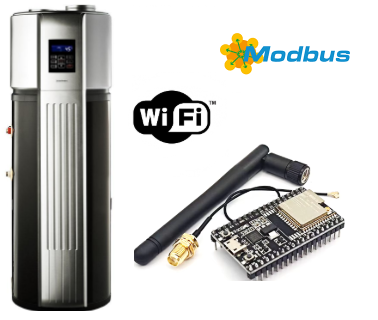

# Coolwex (Sinclair) heatpump control via modbus with ESP32

This project adds modbus interface to old Coolwex DSW-300 (or Sinclair SWH 300) heatpump
from year ~2011 using ESP32 WiFi module. It allows to read current state, set target temperature
and switch device on/off.

ESP32 is connected to SPI of display controller to read current state and to
keyboard matrix to emulate keyboard signals. Whole design is as non-intrusive
as possible to don't risk heatpump damage.

Control board of heatpump is located behind display and is accessible after removal
of front cover.

| Coolwex PCB wire #            | ESP32 board pin #           |
|:------------------------------|:----------------------------|
| 1 5V source                   | 5V in over jumper switch *) |
| 2 GND                         | GND                         |
| 3 Display SPI Data            | GPIO23 over 10K (IN)        |
| 4 Display SPI CS              | GPIO5 over 10K (IN)         |
| 5 Display SPI Clock           | GPIO18 over 10K (IN)        |
| 6 NC                          |                             |
| 7 Keyboard row 1 (top)        | GPIO27 over 1K5 (IN)        |
| 8 Keyboard row 2 (middle)     | GPIO26 over 1K5 (IN)        |
| 9 Keyboard row 3 (bottom)     | GPIO25 over 1K5 (IN)        |
| 10 NC                         |                             |
| 11 Keyboard column 1 (left)   | GPIO15 (OUT)                |
| 12 Keyboard column 1 (middle) | GPIO16 (OUT)                |
| 13 Keyboard column 1 (right)  | GPIO17 (OUT)                |

*) Switch allows disconnecting 5V source from heatpump when ESP board is connected via USB
during programming/debugging.

## Modus interface
Supported operations are: 
* refresh and get status:
  * current display mode
  * 6 temperature sensors (2x water + 4x internals)
  * flags
* get & set target temperature
* get & set power on/off
* press key

All modbus registers, allowed operations and expected values are described in header file
[include/types.h](./include/types.h)

## Photos
Heatpump display controller board with connect points.

Heatpump display controller board with connected wires.

Scheme of ESP32 PCB board with Socket IDC male 16 pin connector

Heatpump display & keyboard

